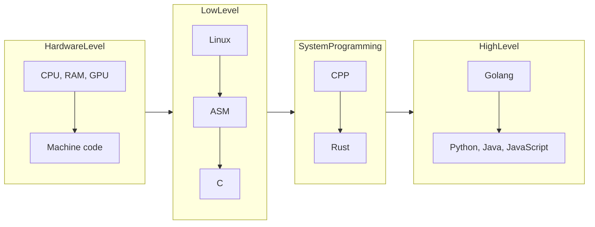

+++
title = "First Post"
date = "2025-11-20"
description = "-"
showFullContent = false
readingTime = true
hideComments = true
toc = true
+++

## Prephrase

The acts of the mind, wherein it exerts its power over simple ideas,
are chiefly these three:

1. Combining several simple ideas into one compound one,
and thus all complex ideas are made.
2. The second is bringing two ideas, whether simple or complex, together,
and setting them by one another so as to take a view of them at once,
without uniting them into one, by which it gets all its ideas of relations.
3. The third is separating them from all other ideas
that accompany them in their real existence:
this is called abstraction, and thus all its general ideas are made.

> [From](https://sarabander.github.io/sicp/html/Chapter-1.xhtml#Chapter-1)

## Four Levels

In series of posts I try to set out my thoughts
about some IT and programming themes.

Let's start with figure out what modern IT based on.
I think we can divide "programming" by 4 "sorts":
"Hardware Level", "Low Level", "System Programming"
and "High Level"

In my opinion to be a real good SDE

## Legend

1. IT - Information technology
2. SDE - Software Developer Engineer
3. ASM - Assembly language
